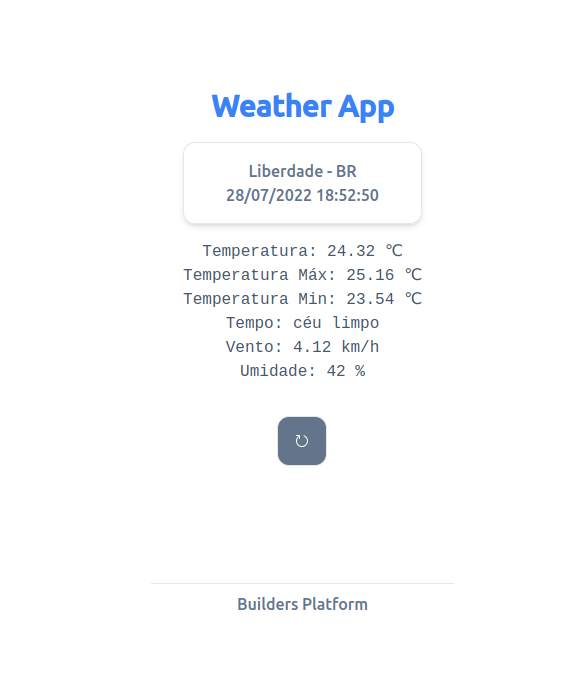

Este é um projeto em [Reactjs](https://pt-br.reactjs.org/) com gerenciador de pacotes [Yarn](https://yarnpkg.com/).

## Builders Plataform Teste Desenvolvedor React Sênior

Rodar a versão em modo de Desenvolvimento:

```bash
yarn run start
```

Abrir [http://localhost:3000](http://localhost:3000) Em seu navegador.




